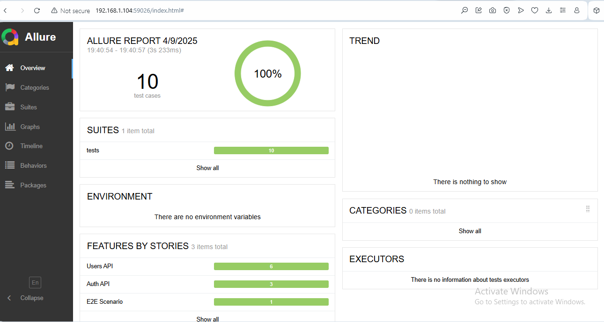
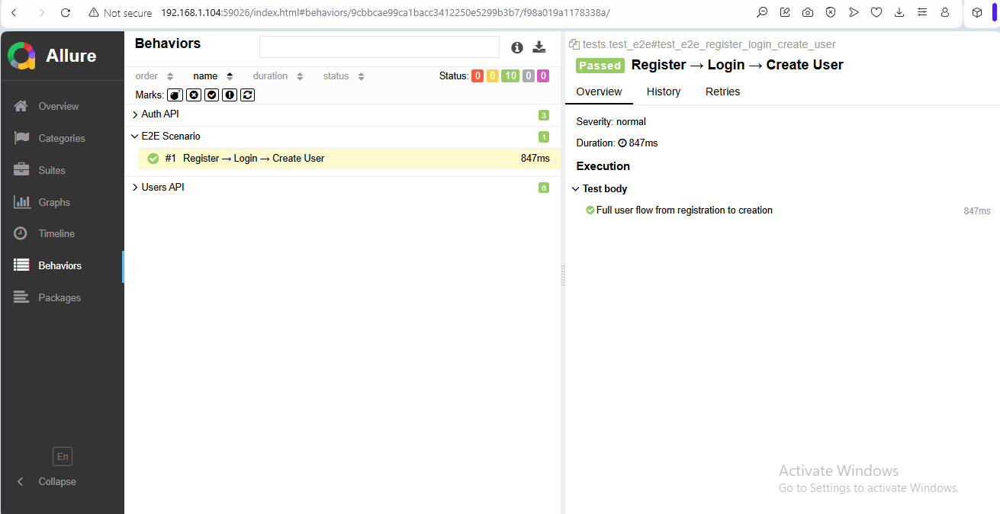

# Reqres API Automation Tests

This project is a demonstration of API test automation using Python and Pytest with the public [reqres.in](https://reqres.in) API.

## ✅ Features

- Python + Pytest
- Test structure with `requests`, `Allure`, and modular helpers
- Separate test layers: unit-level and E2E
- Allure integration for readable reports

## 📂 Project Structure

```
project-root/
├── config/              # API endpoints
├── utils/
│   ├── auth_helpers.py  # login & register logic
│   └── user_helpers.py  # user API logic
├── tests/
│   ├── test_auth.py     # login, register (positive & negative)
│   ├── test_users.py    # user list, single, create, update, delete
│   └── test_e2e.py      # E2E: register → login → create user
```

## 🚀 How to Run

1. Install dependencies:

```bash
pip install -r requirements.txt
```

2. Run all tests:

```bash
pytest tests/ --alluredir=allure-results
```

3. Generate Allure report:

```bash
allure serve allure-results
```

## 📌 Notes

- `reqres.in` is a mock API. Some actions (like registration or deletion) do not persist data.
- Token-based auth is simulated for learning purposes.

## 🔍 Tech Stack

- Python 3.x
- Pytest
- Requests
- Allure for reports

## 📈 Example E2E Covered

- Register user → Login → Create new user

## 🖼 Allure Report Example

### Overview


### E2E Scenario


### Negative Case


## ✍ Author

Created by Anatolii Zakharov as part of QA Automation portfolio.